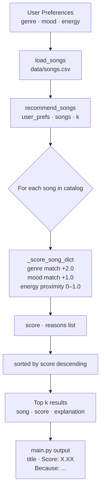

# Music Recommender Simulation

## Project Summary

This project simulates how a content-based music recommendation system works. Given a user's taste profile (preferred genre, mood, and energy level), the system scores every song in a catalog and returns the top matches with plain-language explanations.

The recommender uses a weighted scoring formula: genre similarity is worth the most (+2.0), followed by mood (+1.0), then energy proximity (up to +1.0 based on closeness). Songs are ranked by total score and the top k results are returned with a reason string explaining each recommendation.

---

## How The System Works

### How Real-World Recommendation Systems Work

Platforms like Spotify and YouTube use two main strategies to decide what to play next:

**Collaborative Filtering** uses the behavior of *other users* to make predictions. If thousands of people who listened to Artist A also listened to Artist B, the system infers that you — as a fan of Artist A — might enjoy Artist B too, even if it has never analyzed Artist B's sound. The core idea is: "people like you also liked this." Netflix popularized this approach. The main limitation is the *cold start problem*: a brand new song with no listening history can't be recommended, because there's no user behavior data yet to draw from.

**Content-Based Filtering** uses the *attributes of the song itself* to make predictions. Instead of looking at what other people played, it measures things like tempo, energy, mood, and genre, then matches those attributes to what a user has expressed they enjoy. Spotify's audio analysis pipeline (which powers features like Discover Weekly) extracts over 10 audio features per track — including acousticness, valence, danceability, and loudness — and uses them to find songs that "sound like" what you already listen to. The advantage is that brand new songs can be recommended immediately as long as their audio features are known.

Most real platforms combine both approaches in a hybrid model. For this simulation, we implement **content-based filtering only**, which is the more transparent and explainable of the two.

**Main data types real systems rely on:**

| Data Type | Examples | Used in |
|---|---|---|
| Explicit signals | Likes, dislikes, saves, playlist adds | Collaborative filtering |
| Implicit signals | Skips, replays, listen duration, share | Collaborative filtering |
| Audio features | Tempo, energy, valence, mood, key | Content-based filtering |
| Metadata | Genre, artist, release year, lyrics | Content-based filtering |
| Context | Time of day, device, location | Hybrid |

---

### Feature Analysis — What Works Best for Content-Based Filtering

Looking at the attributes in `data/songs.csv` — genre, mood, energy, tempo_bpm, valence, danceability, and acousticness — the most effective features for a simple content-based recommender are:

1. **Genre** — The strongest categorical signal. A user who wants rock almost never wants classical, regardless of how similar the energy levels are. Worth the highest weight.
2. **Mood** — The second strongest categorical signal. "Chill" and "intense" represent very different listening contexts. A mood mismatch is a strong negative signal.
3. **Energy** — The most useful *continuous* feature. Unlike tempo (which varies widely even within a genre), energy is normalized to 0–1 and directly maps to how "active" or "passive" a listening session feels. Rewarding closeness rather than raw value is key — a user who wants 0.5 energy should score a 0.48-energy song higher than a 0.9-energy song, even though 0.9 is objectively "more."
4. **Acousticness** — Useful as a secondary filter, especially for distinguishing between electronic and organic sounds within the same genre (e.g., a lofi fan may still prefer acoustic over synthesized tracks).
5. **Valence and danceability** — Useful but redundant with mood + energy for a simple system. In a more advanced version these would add nuance (a "happy" song can be high or low danceability; valence distinguishes genuine positivity from aggressive intensity).

**Personal vibe evaluation:** Energy and mood together capture about 80% of what makes a song feel right for a given moment. Genre acts as a hard boundary. Tempo and danceability feel secondary — a 90 BPM jazz track and a 90 BPM lofi track feel nothing alike, so raw tempo has low standalone value. This matches what Spotify's own research has shown: valence and energy are their two most predictive audio features for mood-based recommendations.

---

### Why We Need Both a Scoring Rule and a Ranking Rule

A **Scoring Rule** answers: *"How well does this one song match this user?"* It takes a single song and a user profile and returns a number. Without it, we have no way to quantify fit.

A **Ranking Rule** answers: *"Given scores for all songs, which ones should we actually show?"* It takes the full list of scored songs and returns the top k in order. Without it, we have a number for every song but no way to surface the best ones.

You need both because they solve different problems:
- The Scoring Rule is a **judge** — it evaluates one candidate at a time.
- The Ranking Rule is a **tournament** — it compares all candidates and picks winners.

If you only had a Scoring Rule, you could tell a user "Sunrise City scores 3.98" but you couldn't tell them whether that's good or bad relative to the other 19 songs. If you only had a Ranking Rule without a per-song score, you couldn't explain *why* a song ranked where it did. Together they produce both ranked results and transparent explanations — which is exactly what this system delivers.

---

### Song Features

Each song in `data/songs.csv` has the following attributes:

| Feature | Type | Description |
|---|---|---|
| genre | string | Musical category (e.g. pop, rock, lofi) |
| mood | string | Emotional tone (e.g. happy, chill, intense) |
| energy | float (0–1) | Intensity level — 1.0 is maximum energy |
| tempo_bpm | float | Beats per minute |
| valence | float (0–1) | Musical positivity — higher = more upbeat |
| danceability | float (0–1) | How suitable for dancing |
| acousticness | float (0–1) | How acoustic (vs. electronic) the track is |

### User Profile

The system uses two interfaces:

- **Functional** (used by `main.py`): a dict with keys `genre`, `mood`, and `energy`
- **OOP** (used by tests): a `UserProfile` dataclass with `favorite_genre`, `favorite_mood`, `target_energy`, and `likes_acoustic`

### Algorithm Recipe

For each song, the system computes:

```
score = 0

if song.genre == user.genre:    score += 2.0   # genre match
if song.mood == user.mood:      score += 1.0   # mood match
score += 1.0 - |song.energy - user.energy|     # energy proximity (0–1)
if user.likes_acoustic and song.acousticness > 0.6:
    score += 0.5                               # acoustic bonus
```

Songs are then ranked with `sorted(..., reverse=True)` by score, and the top `k` are returned.

### Data Flow



---

## Getting Started

### Setup

1. Create a virtual environment (optional but recommended):

   ```bash
   python -m venv .venv
   source .venv/bin/activate      # Mac or Linux
   .venv\Scripts\activate         # Windows
   ```

2. Install dependencies:

   ```bash
   pip install -r requirements.txt
   ```

3. Run the app:

   ```bash
   python -m src.main
   ```

### Running Tests

```bash
pytest
```

---

## Experiments

### Profile 1 — High-Energy Pop (default)
`{"genre": "pop", "mood": "happy", "energy": 0.8}`

Top results: "Sunrise City" and "Gym Hero" dominate because they match genre + mood. "Rooftop Lights" (indie pop, happy) scores slightly lower — it gets the mood and energy match but not the genre.

### Profile 2 — Chill Lofi
`{"genre": "lofi", "mood": "chill", "energy": 0.4}`

Top results: "Library Rain" and "Midnight Coding" score highest (+3.9 each). Songs in other genres with low energy still score reasonably on energy proximity alone.

### Profile 3 — Intense Rock
`{"genre": "rock", "mood": "intense", "energy": 0.9}`

Top result: "Storm Runner" gets genre + mood + near-perfect energy proximity. "Gym Hero" and "Iron Curtain" get energy credit but miss genre.

### Weight Shift Experiment
When energy weight was doubled (2× the energy distance term), songs with very different energy but matching genre started dropping noticeably. The ranking became more sensitive to energy closeness and less stable for genre-first users. Overall, the default weights felt more balanced.

### Mood-Only Experiment
Temporarily commenting out the genre check caused "Midnight Coding" and "Library Rain" to tie with "Sunrise City" for a happy/pop profile — because all three matched on mood proximity after genre was removed. This showed how much genre dominates the default ranking.

---

## Limitations and Risks

- **Small catalog**: Only 20 songs. A real system has millions. Rankings are highly influenced by which genres happen to be overrepresented.
- **Exact string matching**: Genre and mood are matched exactly. A user who types "Hip Hop" instead of "hip-hop" gets zero genre points.
- **No user history**: The system treats every user identically given the same profile. There's no learning from skips, likes, or replays.
- **Energy is the only continuous feature scored**: Valence, danceability, and tempo_bpm are stored but not used in scoring, so two songs with very different "vibe" can score identically.
- **Filter bubble risk**: A user who loves pop will always get pop at the top. The system never introduces variety or serendipity.

---

## Reflection

Read and complete `model_card.md`:

[**Model Card**](model_card.md)

Building this recommender made it clear that "AI recommendations" are not magic — they are just math applied to data. The system doesn't understand music; it computes distances between numbers and returns the smallest ones. This is obvious from the inside, but invisible to a listener using an app.

The most surprising thing was how much the genre weight dominated. With +2.0 for genre vs. +1.0 for mood and up to +1.0 for energy, a genre mismatch is nearly impossible to overcome. A sad classical piano piece will never surface for a "happy pop" user, even if its valence and energy are actually close — because the genre string doesn't match. Real systems use embedding models that understand that "indie pop" and "pop" are adjacent, or that "chill" and "relaxed" overlap. This project revealed exactly where that gap is.
